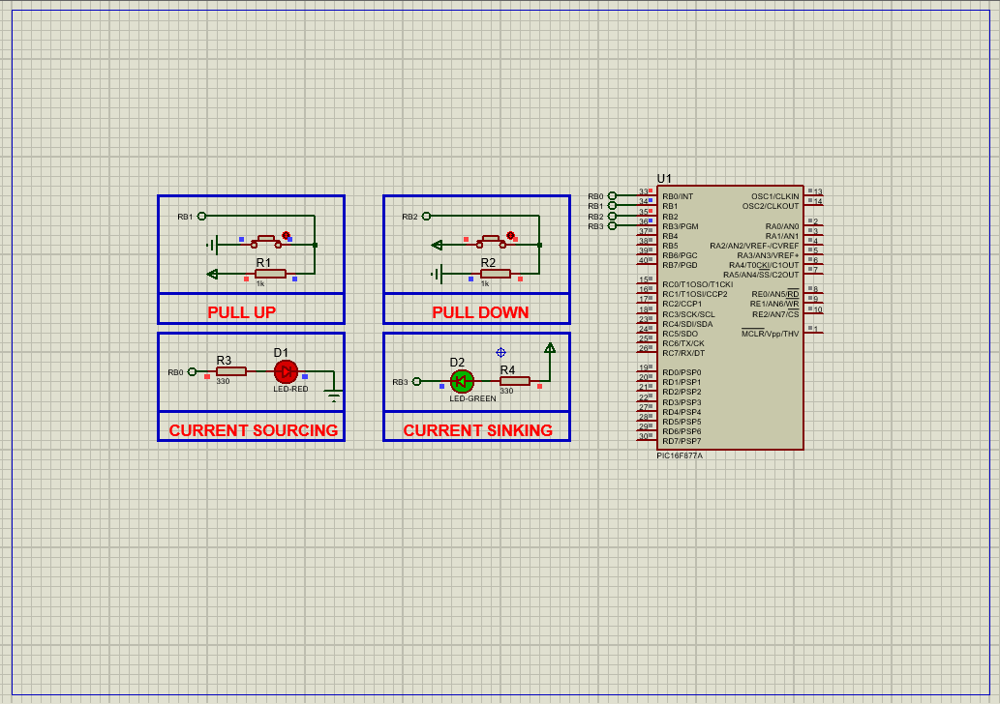

# PIC16F877 GPIO Control: Complete I/O Ports Guide

This project demonstrates **digital I/O control** on the PIC16F877A microcontroller, featuring current sourcing/sinking configurations and input handling with pull-up/pull-down resistors.

---

## Hardware Requirements  
  
- **PIC16F877 Microcontroller**  
- **Push Buttons** (x2 for input control)  
- **LEDs** (x2 for output indication)  
- **10kΩ Resistors** (pull-down for inputs)  
- **330Ω Resistors** (current-limiters for LEDs)  
- **20MHz Crystal Oscillator** + **2x 22pF Capacitors**  
- **5V DC Power Supply**

---

## Circuit Overview  
- **Inputs**:  
  - RB0–RB3 ← Push Buttons (with pull-down resistors)  
- **Outputs**:  
  - RD0–RD3 → LEDs  
- **Oscillator**:  
  - XTAL 20MHz with ceramic capacitors  
- **Power Supply**:  
  - VDD = +5V, VSS = GND

---

## Software Requirements  
- **MPLAB X IDE** (v5.50+)  
- **XC8 Compiler** (v2.36+)  
- **Proteus 8**   (V8.15+)

---

## Configuration Steps  

### MPLAB X & XC8 Setup  
1. **Project Creation**:  
   - Target device: PIC16F877  
   - Compiler: XC8  
2. **Oscillator Setup**:  
   - Use HS mode for 20MHz crystal  
3. **Configuration Bits**:  
   - Watchdog Timer: OFF  
   - Power-up Timer: OFF  
   - Brown-out Reset: ON  
   - LVP: OFF (enables RB3 for digital I/O)

---

### Code Function Overview  
#### Key Code Logic (Described Only):

1. **Pin Initialization**:  
   - PORTB0 to PORTB3 are configured as **inputs** to read the status of connected push buttons.  
   - PORTD0 to PORTD3 are configured as **outputs** to control the connected LEDs.  

2. **Initial States**:  
   - All output pins on PORTD are initialized to **LOW**, ensuring LEDs start off.  

3. **Main Loop Functionality**:  
   - The firmware continuously reads the state of PORTB input pins.  
   - The input values are **mirrored directly** to PORTD outputs.  
   - This means when a button is pressed (logic HIGH), the corresponding LED turns on.  
   - When the button is released (logic LOW), the corresponding LED turns off.

---

### Proteus Simulation  
1. **Components**:  
   - Add PIC16F877A, LEDs, resistors, buttons  
2. **Connections**:  
   - Match hardware schematic pinouts  
   - Configure power supply (5V)  
3. **Running Simulation**:  
   - Import compiled `.hex` into PIC  
   - Toggle switches during simulation  
   - Observe real-time LED output response

---

## Troubleshooting  
| Symptom               | Likely Cause               | Solution                    |  
|-----------------------|---------------------------|-----------------------------|  
| LED not responding    | Incorrect TRISB settings   | Verify TRISB0/TRISB3 = 0    |  
| Button stuck active   | Missing pull-up/down       | Check 10kΩ resistor wiring  |  
| Erratic LED toggling  | No debounce delay          | Increase delay to 15-20ms   |  
| Simulation crashes    | Missing decoupling caps    | Add 100nF VDD-GND capacitors|   

---

## License  
**MIT License** — Free to use with attribution  
