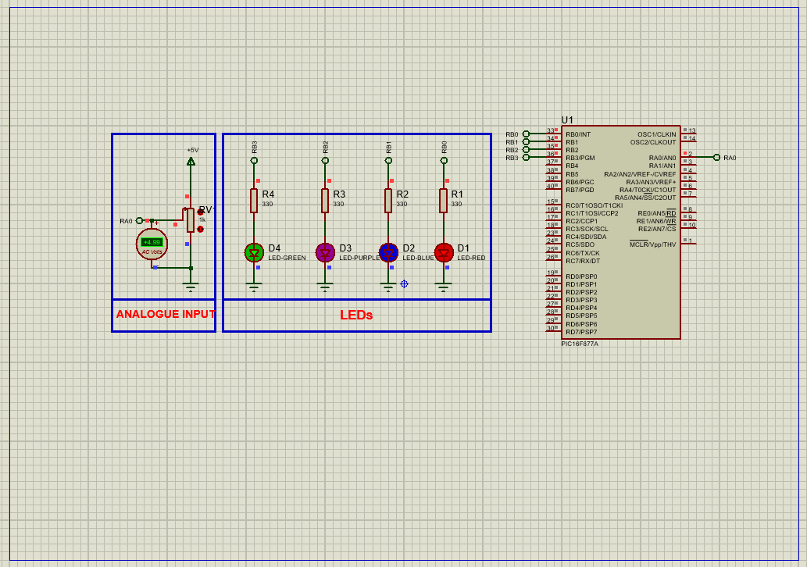

# PIC16F877 ADC LED Threshold Control: Analog Signal Monitoring Project

This project demonstrates how to use the **Analog-to-Digital Converter (ADC)** of the **PIC16F877A microcontroller** to monitor analog voltages and visualize signal thresholds via four LEDs, enabling simple analog sensor-based feedback.

---

## Hardware Requirements  
  
- **PIC16F877 Microcontroller**  
- **Analog Sensor / Potentiometer** (for analog input)  
- **LEDs** (x4 for visual thresholds)  
- **330Ω Resistors** (LED current limiters)  
- **10kΩ Potentiometer** (for variable analog signal)  
- **4MHz Crystal Oscillator** + **2x 22pF Capacitors**  
- **5V DC Power Supply**

---

## Circuit Overview  
- **Analog Input**:  
  - RA0/AN0 ← Analog signal (0–5V range via potentiometer)  
- **Digital Outputs**:  
  - RB0–RB3 → LEDs (indicating different ADC value ranges)  
- **Oscillator**:  
  - XTAL 4MHz with ceramic capacitors  
- **Power Supply**:  
  - VDD = +5V, VSS = GND

---

## Software Requirements  
- **MPLAB X IDE** (v5.50+)  
- **XC8 Compiler** (v2.36+)  
- **Proteus 8** (V8.15+)

---

## Configuration Steps  

### MPLAB X & XC8 Setup  
1. **Project Creation**:  
   - Target device: PIC16F877  
   - Compiler: XC8  
2. **Oscillator Setup**:  
   - Use XT mode for 4MHz crystal  
3. **Configuration Bits**:  
   - Watchdog Timer: OFF  
   - Power-up Timer: OFF  
   - Brown-out Reset: ON  
   - LVP: OFF (enables RB3 as digital I/O)

---

### Code Function Overview  
#### Key Code Logic (Described Only):

1. **Pin Initialization**:  
   - RB0 to RB3 are configured as **digital outputs** to control four LEDs.  
   - RA0/AN0 is configured as **analog input** connected to a potentiometer.

2. **ADC Setup**:  
   - The ADC module is initialized to read analog voltage from channel AN0.  
   - ADC clock and reference voltages are set for accurate conversions.

3. **Main Loop Functionality**:  
   - In each cycle, the code starts an ADC conversion and waits for completion.  
   - The digital result is read and compared to threshold values (250, 500, 750, 1000).  
   - LEDs are turned on progressively based on the input voltage level:  
     - >250 → LED1 ON  
     - >500 → LED2 ON  
     - >750 → LED3 ON  
     - >1000 → LED4 ON  
   - All LEDs are turned OFF at the start of each read cycle to avoid overlap.  
   - A 1-second delay spaces the readings.

---

### Proteus Simulation  
1. **Components**:  
   - Add PIC16F877A, 4 LEDs, 4 resistors, 1 potentiometer  
2. **Connections**:  
   - Connect potentiometer to RA0 (analog input)  
   - Connect LEDs to RB0–RB3 with 330Ω resistors  
   - Use 4MHz crystal oscillator between OSC1 & OSC2  
3. **Running Simulation**:  
   - Import compiled `.hex` file into PIC  
   - Adjust potentiometer to vary analog input  
   - Observe LEDs lighting up as thresholds are crossed

---

## Troubleshooting  
| Symptom                  | Likely Cause                  | Solution                          |  
|--------------------------|-------------------------------|-----------------------------------|  
| No LED activity          | Incorrect ADC setup           | Verify ADCON0 and ADCON1 settings |  
| LED always ON            | Incorrect threshold logic     | Review ADC value comparisons      |  
| ADC reads zero constantly| Floating analog pin           | Ensure potentiometer is connected |  
| Simulation fails         | Crystal misconfigured         | Use proper 4MHz and 22pF caps     |

---

## License  
**MIT License** — Free to use with attribution
