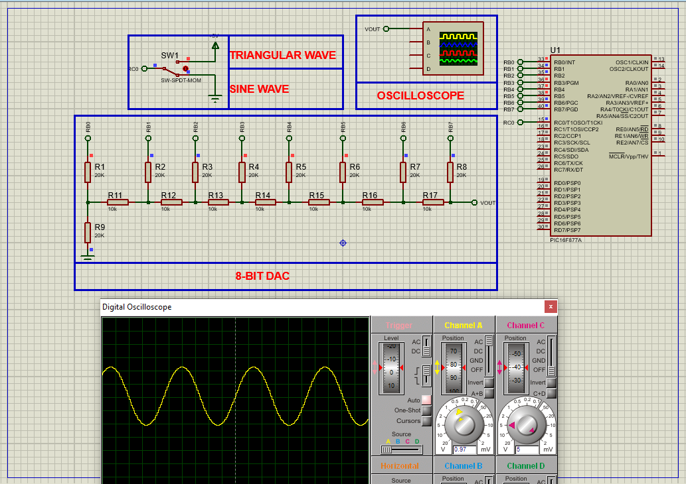

# PIC16F877 DAC Waveform Generator: Sinusoidal & Triangular Signal Output

This project demonstrates how to implement **digital-to-analog waveform generation** using the **PIC16F877A microcontroller**, utilizing DAC techniques to output sinusoidal and triangular signals via lookup tables and a switch-based waveform selector.

---

## Hardware Requirements  
  
- **PIC16F877 Microcontroller**  
- **Resistor Network (R-2R DAC or Binary Weighted)**  
- **Oscilloscope / DAC Output Monitor**  
- **Push Button Switch** (for waveform selection)  
- **4MHz Crystal Oscillator** + **2x 22pF Capacitors**  
- **5V DC Power Supply**

---

## Circuit Overview  
- **DAC Output**:  
  - PORTB<0:7> → R-2R Ladder or Summing Op-Amp  
- **Input Selector**:  
  - RC0 ← Push Button (waveform toggle)  
- **Oscillator**:  
  - 4MHz crystal between OSC1 & OSC2  
- **Power Supply**:  
  - VDD = +5V, VSS = GND

---

## Software Requirements  
- **MPLAB X IDE** (v5.50+)  
- **XC8 Compiler** (v2.36+)  
- **Proteus 8** (V8.15+)

---

## Configuration Steps  

### MPLAB X & XC8 Setup  
1. **Project Creation**:  
   - Target device: PIC16F877  
   - Compiler: XC8  
2. **Oscillator Setup**:  
   - Use XT mode for 4MHz crystal  
3. **Configuration Bits**:  
   - Watchdog Timer: OFF  
   - Power-up Timer: OFF  
   - Brown-out Reset: ON  
   - LVP: OFF (frees RB3 for digital use)

---

### Code Function Overview  
#### Key Code Logic (Described Only):

1. **Waveform Lookup Tables**:  
   - Two arrays are created, each with **64 samples**:  
     - One for a **sine wave**  
     - One for a **triangular wave**  
   - Each value represents an 8-bit DAC level (0–255).

2. **Pin Configuration**:  
   - PORTB is configured as **output** for DAC signal (8-bit).  
   - RC0 is set as **input** for waveform selection via a push button.

3. **Main Loop Functionality**:  
   - Reads the state of the switch connected to RC0.  
   - Based on the switch state:  
     - If OFF → **sinusoidal waveform** is output  
     - If ON → **triangular waveform** is output  
   - Data from the corresponding lookup table is written sequentially to PORTB.  
   - A small delay defines the **waveform frequency**.  
   - After reaching the end of the table, the index resets to loop the waveform.

---

### Proteus Simulation  
1. **Components**:  
   - PIC16F877A, resistor DAC network or op-amp summing DAC  
   - Switch, crystal, oscilloscope  
2. **Connections**:  
   - PORTB<0:7> → DAC network → Oscilloscope input  
   - RC0 ← push button (with pull-down resistor)  
   - Power supply (5V), XTAL on OSC1 & OSC2  
3. **Running Simulation**:  
   - Load `.hex` file  
   - Observe waveform on oscilloscope  
   - Press switch to toggle between waveform types

---

## Troubleshooting  
| Symptom                | Likely Cause                  | Solution                         |  
|------------------------|-------------------------------|----------------------------------|  
| No waveform output     | PORTB not set as output       | Ensure TRISB = 0x00              |  
| Distorted waveform     | Bad resistor tolerances       | Use 1% or better R-2R resistors  |  
| No switch response     | RC0 not pulled properly       | Add 10kΩ pull-down to RC0        |  
| Flatline waveform      | Delay too short or DAC error  | Increase delay, check wiring     |

---

## License  
**MIT License** — Free to use with attribution
