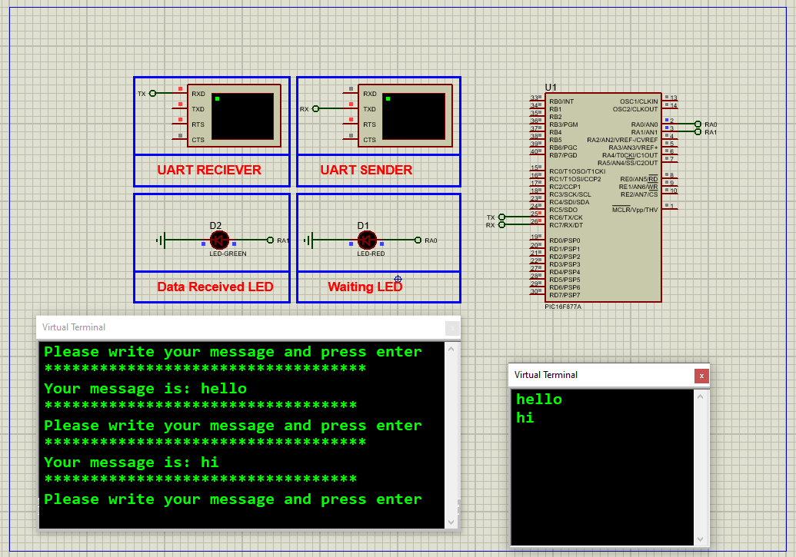

# PIC16F877 UART: Serial Communication with LED Indicators

This project demonstrates how to implement **serial communication protocols** using the **PIC16F877A microcontroller**, featuring UART-based data transmission with terminal interaction and visual LED status indicators.

---

## Hardware Requirements  
  
- **PIC16F877 Microcontroller**  
- **USB-UART Converter (FT232RL) / Virtual Terminal (Proteus)**  
- **Status LEDs (2x)** - Transmission/Reception indicators  
- **4MHz Crystal Oscillator** + **2x 22pF Capacitors**  
- **5V DC Power Supply**  
- **Push Button (Optional for reset)**  

---

## Circuit Overview  
- **UART Interface**:  
  - **TX (RC6)** → Terminal RX  
  - **RX (RC7)** ← Terminal TX  
- **LED Indicators**:  
  - **LED1 (RA0)** - Blinks during transmission  
  - **LED2 (RA1)** - Activates on data reception  
- **Oscillator**:  
  - 4MHz crystal between OSC1 & OSC2  
- **Power Supply**:  
  - VDD = +5V, VSS = GND  

---

## Software Requirements  
- **MPLAB X IDE** (v5.50+)  
- **XC8 Compiler** (v2.36+)  
- **Proteus 8 Professional** (V8.15+)  
- **Terminal Emulator (PuTTY/TeraTerm)**  

---

## Configuration Steps  

### MPLAB X & XC8 Setup  
1. **Project Creation**:  
   - Target device: PIC16F877  
   - Compiler: XC8  
2. **UART Configuration**:  
   - Baud rate: 9600 bps (SPBRG = 51 @ 8MHz)  
   - Asynchronous mode (SYNC = 0)  
3. **Configuration Bits**:  
   - Watchdog Timer: OFF  
   - Power-up Timer: OFF  
   - Brown-out Reset: ON  
   - LVP: OFF  

---

### Code Function Overview  
#### Key Code Logic (Described Only):

1. **UART Initialization**:  
   - High-speed baud rate (BRGH = 1)  
   - Serial port enabled (SPEN = 1)  
   - Transmission enabled (TXEN = 1)  
   - Continuous receive (CREN = 1)  

2. **Data Handling**:  
   - **Transmit**: Checks TXREG status before sending  
   - **Receive**: Waits for RCIF flag before reading  

3. **LED Feedback System**:  
   - LED1 blinks during transmission wait state  
   - LED2 pulses on successful data reception  

---

### Proteus Simulation  
1. **Components**:  
   - PIC16F877A, Virtual Terminal, LEDs  
2. **Connections**:  
   - RC6 (TX) → Terminal RX  
   - RC7 (RX) ← Terminal TX  
   - RA0/RA1 → LEDs with current-limiting resistors  
3. **Operation**:  
   - Load compiled HEX file  
   - Send messages from terminal  
   - Observe echoed responses and LED activity  

---

## Troubleshooting  
| Symptom               | Likely Cause               | Solution                      |  
|-----------------------|----------------------------|-------------------------------|  
| No terminal output    | Incorrect baud rate        | Verify SPBRG calculation      |  
| Garbled characters    | Clock mismatch             | Check crystal configuration  |  
| LEDs not responding   | Wrong TRISA settings       | Set RA0/RA1 as outputs       |  
| Data not received     | CREN bit not enabled       | Enable continuous receive    |  

---

## License  
**MIT License** — Free to use with attribution  
