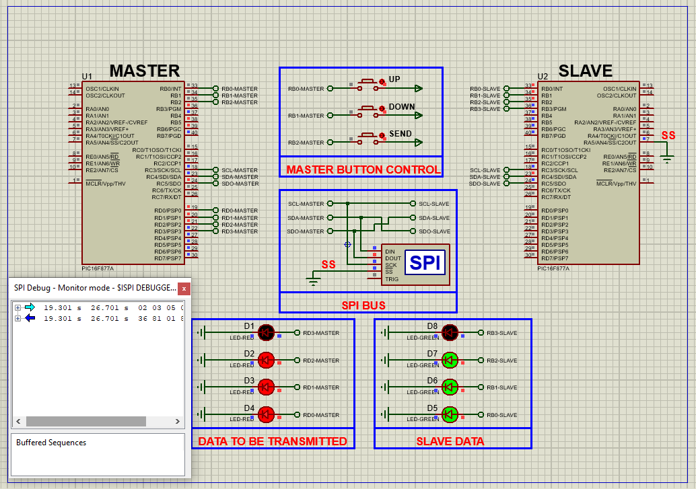

# PIC16F877 SPI Communication Guide

This project demonstrates how to implement **SPI (Serial Peripheral Interface) communication** using the **PIC16F877A microcontroller**, enabling high-speed data transfer between master and slave devices.

---

## Hardware Requirements  
  
- **PIC16F877 Microcontroller (2x for master/slave demo)**  
- **SPI-Compatible Peripheral (e.g., EEPROM, sensor, or second PIC)**  
- **Logic Analyzer/Oscilloscope (for signal verification)**  
- **4MHz Crystal Oscillator** + **2x 22pF Capacitors**  
- **5V DC Power Supply**  
- **Push Buttons (3x for master control)**  

---

## Circuit Overview  
- **SPI Bus Connections**:  
  - **SDO (RC5)** → SDI of slave  
  - **SDI (RC4)** ← SDO of slave  
  - **SCK (RC3)** → Shared clock line  
  - **SS (RA5)** → Slave select (optional)  
- **Control Interface**:  
  - **RB0** - Increment data button  
  - **RB1** - Decrement data button  
  - **RB2** - Send data button  
- **Oscillator**:  
  - 4MHz crystal between OSC1 & OSC2  

---

## Software Requirements  
- **MPLAB X IDE** (v5.50+)  
- **XC8 Compiler** (v2.36+)  
- **Proteus 8 Professional** (V8.15+)  

---

## Configuration Steps  

### MPLAB X & XC8 Setup  
1. **Project Creation**:  
   - Target device: PIC16F877  
   - Compiler: XC8  
2. **SPI Configuration**:  
   - Mode: Master/Slave (SSPM3:0 bits)  
   - Clock: Fosc/64 (default)  
3. **Configuration Bits**:  
   - Watchdog Timer: OFF  
   - Brown-out Reset: ON  
   - LVP: OFF  

---

### Code Function Overview  
#### Key Code Logic (Described Only):

1. **SPI Initialization**:  
   - Master Mode: SCK as output, SDO as output  
   - Slave Mode: SCK as input, SDI as input  
   - Clock polarity/phase configured via CKP/CKE bits  

2. **Data Transfer**:  
   - Master writes to SSPBUF to initiate transmission  
   - Slave reads SSPBUF on interrupt (SSPIF)  

3. **User Interface**:  
   - Buttons adjust 8-bit data value  
   - PORTD displays current data value  

---

### Proteus Simulation  
1. **Components**:  
   - PIC16F877A (2x), Virtual Terminal, Logic Analyzer  
2. **Connections**:  
   - Full SPI bus between master/slave  
   - Buttons to RB0-RB2 on master  
3. **Operation**:  
   - Monitor SPI traffic with logic analyzer  
   - Verify slave response via PORTB LEDs  

---

## Troubleshooting  
| Symptom                | Likely Cause                  | Solution                         |  
|------------------------|-------------------------------|----------------------------------|  
| No data transfer       | SSPEN bit not set             | Enable SPI (SSPEN=1)             |  
| Garbled data           | Clock polarity mismatch       | Match CKP/CKE on both devices    |  
| Slave not responding   | SS pin not managed properly   | Configure SS pin or use polling  |  
| Slow communication     | Incorrect clock prescaler     | Adjust SSPM3:0 bits              |  

---

## License  
**MIT License** — Free to use with attribution  
