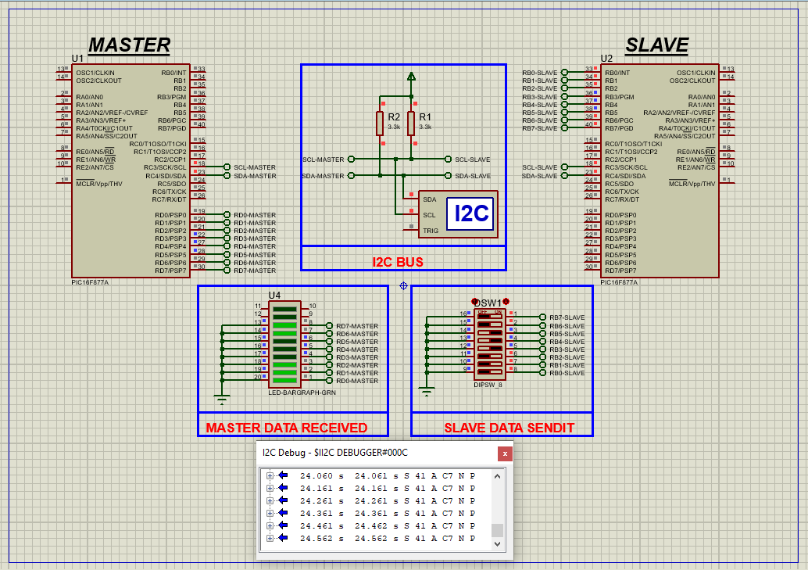

# PIC16F877 I2C Communication Guide

This project demonstrates how to implement **I2C (Inter-Integrated Circuit) communication** using the **PIC16F877A microcontroller**, enabling reliable data transfer between master and slave devices with minimal wiring.

---

## Hardware Requirements  
  
- **PIC16F877 Microcontroller**  
- **I2C-Compatible Device (e.g., EEPROM 24C02, RTC DS1307)**  
- **4.7kΩ Pull-up Resistors (2x)** - For SDA/SCL lines  
- **4MHz Crystal Oscillator** + **2x 22pF Capacitors**  
- **5V DC Power Supply**  
- **I2C LCD Display (Optional for output)**  

---

## Circuit Overview  
- **I2C Bus Connections**:  
  - **SDA (RC4)** → Bidirectional data line with pull-up  
  - **SCL (RC3)** → Clock line with pull-up  
- **Device Addressing**:  
  - Configure slave address via hardware pins (A0-A2)  
- **Oscillator**:  
  - 4MHz crystal between OSC1 & OSC2  

---

## Software Requirements  
- **MPLAB X IDE** (v5.50+)  
- **XC8 Compiler** (v2.36+)  
- **Proteus 8 Professional** (V8.15+)  

---

## Configuration Steps  

### MPLAB X & XC8 Setup  
1. **Project Creation**:  
   - Target device: PIC16F877  
   - Compiler: XC8  
2. **I2C Configuration**:  
   - Master Mode: 100kHz standard mode  
   - SSPADD = 10 for 100kHz @ 4MHz Fosc  
3. **Configuration Bits**:  
   - Watchdog Timer: OFF  
   - Brown-out Reset: ON  

---

### Code Function Overview  
#### Key Code Logic (Described Only):

1. **I2C Initialization**:  
   - Set SSPCON/SSPCON2 registers  
   - Enable Start/Stop condition detection  

2. **Data Transfer Protocol**:  
   - Start condition → Address + R/W bit → ACK → Data → Stop  
   - Clock stretching handled automatically  

3. **Error Handling**:  
   - Bus collision detection (BCLIF)  
   - ACK status verification  

---

### Proteus Simulation  
1. **Components**:  
   - PIC16F877A, I2C EEPROM, Logic Analyzer  
2. **Connections**:  
   - SDA/SCL lines with pull-ups  
   - Address pins grounded (A0-A2 = 0)  
3. **Operation**:  
   - Write/read EEPROM addresses  
   - Monitor bus traffic with logic analyzer  

---

## Troubleshooting  
| Symptom                | Likely Cause                  | Solution                         |  
|------------------------|-------------------------------|----------------------------------|  
| No ACK from slave      | Incorrect slave address       | Verify device addressing         |  
| Bus lockup             | Missing stop condition        | Add manual stop condition reset  |  
| Data corruption        | Weak pull-up resistors        | Use 4.7kΩ or lower value        |  
| Clock issues           | Clock stretching timeout      | Adjust SSPADD for lower speed    |  

---

## License  
**MIT License** — Free to use with attribution  