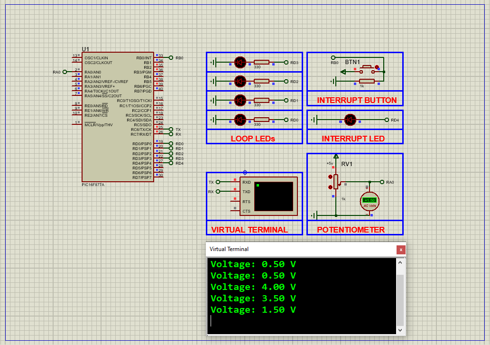

# PIC16F877 Interrupts: Key Techniques and Tips  

This project demonstrates **interrupt-driven programming** on the **PIC16F877A microcontroller**, covering configurations for external, timer, and port-change interrupts with real-time LED status feedback.  

---

## Hardware Requirements  
  
- **PIC16F877 Microcontroller**  
- **Tactile Switches (2x)** - For triggering external/RB port-change interrupts  
- **LEDs (3x)** - Visual indicators for interrupt status  
- **4MHz Crystal Oscillator** + **2x 22pF Capacitors**  
- **5V DC Power Supply**  
- **10kΩ Pull-up Resistors (Optional)**  

---

## Circuit Overview  
- **Interrupt Sources**:  
  - **RB0/INT** - External interrupt (edge-triggered)  
  - **RB4-RB7** - Port-change interrupt (level-triggered)  
  - **Timer0** - Overflow interrupt  
- **Status Indicators**:  
  - **RA0** - External interrupt (RB0) status  
  - **RA1** - Timer0 overflow status  
  - **RA2** - Port-change (RB4-RB7) status  
- **Oscillator**:  
  - 4MHz crystal connected to **OSC1** and **OSC2**  
- **Power**:  
  - **VDD = +5V**, **VSS = GND**  

---

## Software Requirements  
- **MPLAB X IDE** (v5.50+)  
- **XC8 Compiler** (v2.36+)  
- **Proteus 8 Professional** (V8.15+)  

---

## Configuration Steps  

### MPLAB X & XC8 Setup  
1. **Project Creation**:  
   - Device: PIC16F877  
   - Compiler: XC8  
2. **Interrupt Configuration**:  
   - Global Interrupt Enable (GIE)  
   - Peripheral Interrupt Enable (PEIE)  
   - Edge selection for RB0/INT (INTEDG bit)  
3. **Configuration Bits**:  
   - Watchdog Timer: **OFF**  
   - Power-up Timer: **ON**  
   - Brown-out Reset: **ON**  
   - Low-Voltage Programming: **OFF**  

---

### Code Function Overview  
#### Key Logic (Described Without Code):  

1. **Interrupt Service Routine (ISR)**:  
   - Checks and clears **INTF** (RB0), **T0IF** (Timer0), and **RBIF** (Port-Change) flags  
   - Toggles corresponding LEDs (RA0-RA2) on interrupt events  

2. **Initialization Functions**:  
   - Configures **TRISA** and **TRISB** for I/O  
   - Enables weak pull-ups on PORTB  
   - Sets Timer0 prescaler and initial value  

3. **Main Loop**:  
   - Implements sleep mode (**SLEEP()** instruction)  
   - Wakes on interrupt events  

---

## Proteus Simulation  
1. **Components**:  
   - PIC16F877A, LEDs, Push Buttons, Virtual Terminal  
2. **Connections**:  
   - **RB0** ↔ Push Button (External Interrupt)  
   - **RB4-RB7** ↔ DIP Switch (Port-Change Interrupt)  
   - **RA0-RA2** ↔ LEDs with 220Ω Resistors  
3. **Simulation Steps**:  
   - Load `.hex` file into microcontroller  
   - Trigger interrupts via buttons/switches  
   - Observe LED toggling and terminal logs  

---

## Troubleshooting  
| Symptom                | Likely Cause                  | Solution                         |  
|------------------------|-------------------------------|----------------------------------|  
| Interrupts not firing  | GIE/PEIE bits disabled        | Enable GIE and PEIE in INTCON    |  
| LEDs remain off        | Incorrect TRISA configuration | Set RA0-RA2 as outputs           |  
| Multiple false triggers| Switch bouncing               | Add 100ms debounce delay         |  
| Timer0 inaccuracies    | Incorrect prescaler value     | Recalculate TMR0 initial value   |  

---

## License  
**MIT License** — Free to use with attribution  