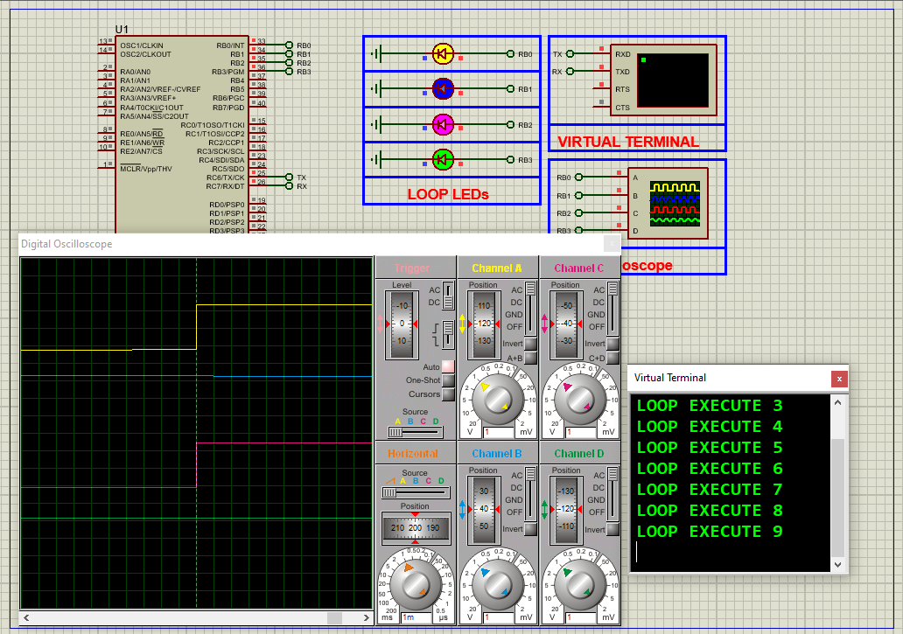

# PIC16F877 Timer-Based LED Toggler with UART Monitoring

This project demonstrates the use of **Timer2** on the **PIC16F877A microcontroller** to control multiple LEDs with precise time intervals, while simultaneously transmitting periodic status messages over UART. This approach enhances efficiency, precision, and observability in embedded systems.

---

## Hardware Requirements  
  
- **PIC16F877A Microcontroller**  
- **LEDs** (x4 for timer-based toggling)  
- **330Ω Resistors** (current limiters for LEDs)  
- **Virtual Terminal** (UART output monitoring)  
- **8MHz Crystal Oscillator** + **2x 22pF Capacitors**  
- **5V DC Power Supply**

---

## Circuit Overview  
- **Outputs**:  
  - RB0–RB3 → LEDs (toggled by Timer2 interrupt)  
- **UART Interface**:  
  - RC6 (TX) → Virtual Terminal RX  
  - Baud Rate: 9600 bps  
- **Oscillator**:  
  - 8MHz crystal between OSC1 & OSC2  
- **Power Supply**:  
  - VDD = +5V, VSS = GND

---

## Software Requirements  
- **MPLAB X IDE** (v5.50+)  
- **XC8 Compiler** (v2.36+)  
- **Proteus 8** (V8.15+)

---

## Configuration Steps  

### MPLAB X & XC8 Setup  
1. **Project Creation**:  
   - Target device: PIC16F877A  
   - Compiler: XC8  
2. **Oscillator Setup**:  
   - Use HS mode for 8MHz crystal  
3. **Configuration Bits**:  
   - Watchdog Timer: OFF  
   - Power-up Timer: ON  
   - Brown-out Reset: ON  
   - LVP: OFF (frees RB3 for output)  

---

### Code Function Overview  
#### Key Code Logic (Described Only):

1. **Pin Configuration**:  
   - PORTB<0:3> are set as **outputs** for LEDs.  
   - PORTC<6:7> are used for UART TX/RX.

2. **Timer2 Initialization**:  
   - Timer2 is configured with a **1:16 prescaler** and **PR2 = 124**, yielding ~100ms overflow.  
   - The Timer2 interrupt is enabled and used to increment software counters.

3. **Interrupt Service Routine (ISR)**:  
   - The ISR triggers on Timer2 overflow.  
   - Software counters track elapsed time.  
   - LEDs on RB0–RB3 toggle at 10s, 20s, 30s, and 40s respectively.

4. **UART Communication**:  
   - UART is initialized for 9600 bps at 8MHz.  
   - A loop counter message is sent every second over UART.  
   - Example message: `"LOOP EXECUTE 125"`.

---

### Proteus Simulation  
1. **Components**:  
   - PIC16F877A, 4x LEDs, resistors, virtual terminal  
2. **Connections**:  
   - RB0–RB3 → LEDs (with resistors)  
   - RC6 → Virtual Terminal RX  
   - 8MHz crystal to OSC1 & OSC2  
3. **Running Simulation**:  
   - Load the compiled `.hex` file  
   - Observe LEDs blinking at defined intervals  
   - Monitor UART messages in the virtual terminal

---

## Troubleshooting  
| Symptom                  | Likely Cause                   | Solution                         |  
|--------------------------|--------------------------------|----------------------------------|  
| No LED blinking          | Timer2 misconfigured           | Check PR2 and prescaler settings |  
| UART not transmitting    | Baud rate mismatch             | Confirm baud and SPBRG = 51      |  
| Wrong timing             | Incorrect interrupt counting   | Validate delay logic             |  
| No UART output in Proteus| TX pin or terminal miswired    | Confirm RC6 connected to RX      |

---

## License  
**MIT License** — Free to use with attribution
