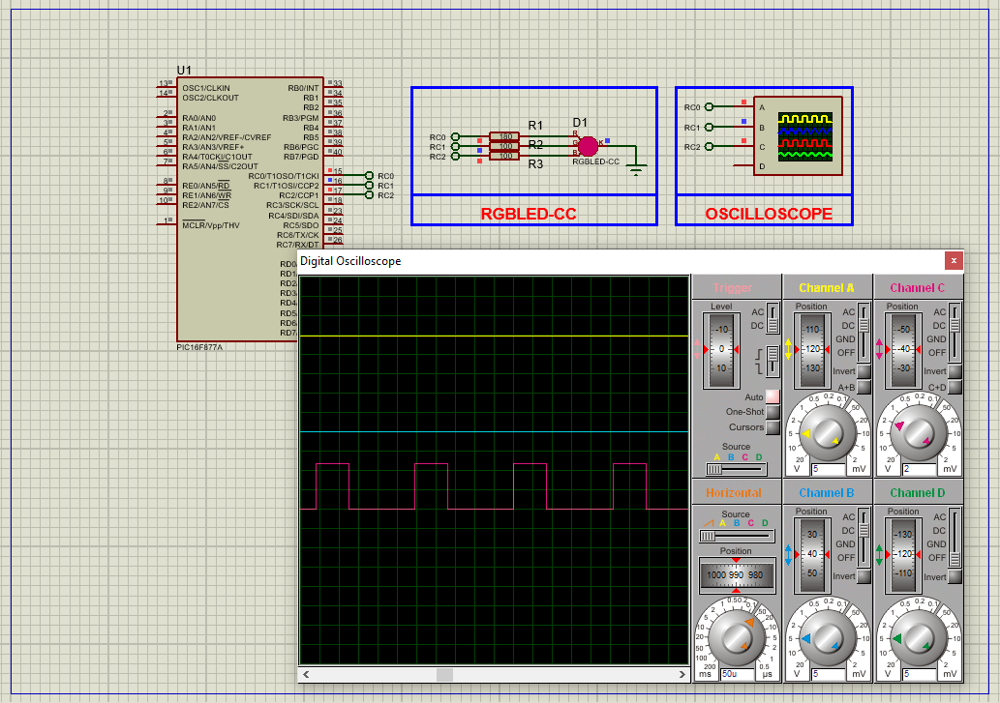

# PIC16F877 PWM-Based RGB LED Control

This project demonstrates the use of **PWM (Pulse Width Modulation)** on the **PIC16F877A microcontroller** to control an RGB LED's brightness and color transitions. It provides smooth fading effects by gradually adjusting PWM duty cycles on the red and green channels.

---

## Hardware Requirements  
  
- **PIC16F877A Microcontroller**  
- **Common Cathode RGB LED**  
- **330Ω Resistors** (x3 for each LED channel)  
- **Oscilloscope** (to visualize PWM waveforms)  
- **4MHz Crystal Oscillator** + **2x 22pF Capacitors**  
- **5V DC Power Supply**

---

## Circuit Overview  
- **PWM Outputs**:  
  - RC0 → Red LED (via CCP1 PWM)  
  - RC1 → Green LED (via CCP2 PWM)  
  - RC2 → Blue LED (basic ON/OFF or external control)  
- **Oscillator**:  
  - XTAL 4MHz connected to OSC1 & OSC2  
- **Power Supply**:  
  - VDD = +5V, VSS = GND

---

## Software Requirements  
- **MPLAB X IDE** (v5.50+)  
- **XC8 Compiler** (v2.36+)  
- **Proteus 8** (V8.15+)

---

## Configuration Steps  

### MPLAB X & XC8 Setup  
1. **Project Creation**:  
   - Target device: PIC16F877A  
   - Compiler: XC8  
2. **Oscillator Setup**:  
   - Use XT mode with 4MHz crystal  
3. **Configuration Bits**:  
   - Watchdog Timer: OFF  
   - Power-up Timer: OFF  
   - Brown-out Reset: ON  
   - LVP: OFF (frees up digital I/O)

---

### Code Function Overview  
#### Key Code Logic (Described Only):

1. **Pin Assignments**:  
   - RC0: Red LED  
   - RC1: Green LED  
   - RC2: Blue LED (non-PWM control or additional hardware required)

2. **PWM Initialization**:  
   - Timer2 is configured with no prescaler (1:1)  
   - PR2 is set for 8-bit resolution (PWM period)  
   - CCP1 and CCP2 modules are initialized for PWM mode  
   - Timer2 is enabled to start PWM signal generation

3. **RGB Control Logic**:  
   - A function is used to set the PWM duty cycle for each LED channel  
   - Red and green LEDs are controlled via CCPR1L and CCPR2L registers  
   - The blue LED is referenced but requires additional hardware for PWM support  

4. **Main Loop Behavior**:  
   - The red LED intensity is gradually increased from 0 to 255 with delays to create a fading effect  
   - Once complete, the same fading transition is applied to the green LED  
   - The process repeats, creating smooth, looped transitions between red and green light  
   - Blue LED remains inactive or controlled externally

---

### Proteus Simulation  
1. **Components**:  
   - PIC16F877A, RGB LED, 3x resistors  
2. **Connections**:  
   - RC0–RC2 to RGB LED pins via resistors  
   - XTAL 4MHz + 22pF caps on OSC1/OSC2  
   - Connect oscilloscope probes to PWM channels (RC0 & RC1) for visualization  
3. **Running Simulation**:  
   - Load compiled `.hex` file into PIC  
   - Observe smooth brightness transitions in red and green LEDs  
   - Use oscilloscope to verify PWM signal waveforms

---

## Troubleshooting  
| Symptom                | Likely Cause                      | Solution                          |  
|------------------------|-----------------------------------|-----------------------------------|  
| LEDs not fading        | PWM not initialized               | Check Timer2 and CCP configs      |  
| Blue LED not dimming   | No CCP module for RC2             | Use software PWM or external DAC  |  
| Flickering LEDs        | Low PWM frequency or unstable Vdd | Increase PR2 or stabilize power   |  
| No PWM output on scope | Wrong pin or TRIS misconfig       | Ensure RC0/RC1 set as output      |

---

## License  
**MIT License** — Free to use with attribution
