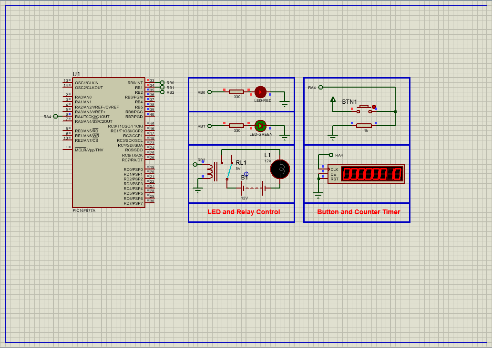

# PIC16F877 Timer0 Counter Mode: Event Counter with LED and Relay Control

This project demonstrates how to configure the **PIC16F877A microcontroller's Timer0** in **Counter Mode** to count external pulses through the **T0CKI (RA4)** pin. Based on the count value, the system controls two LEDs and a relay, providing visual and hardware feedback at predefined thresholds.

---

## Hardware Requirements  
  
- **PIC16F877A Microcontroller**  
- **Button** (connected to RA4/T0CKI)  
- **LEDs** (x2 – RED and GREEN)  
- **Relay + Lamp**  
- **Resistors (330Ω for LEDs)**  
- **4MHz Crystal Oscillator** + **2x 22pF Capacitors**  
- **5V DC Power Supply**

---

## Circuit Overview  
- **Input**:  
  - RA4/T0CKI ← Button (or pulse generator)  
- **Outputs**:  
  - RB0 → LED1 (activates at count ≥ 5)  
  - RB1 → LED2 (activates at count ≥ 10)  
  - RB2 → Relay (activates at count ≥ 15)  
- **Timer Configuration**:  
  - TMR0 operates in **8-bit Counter Mode**  
  - Counts low-to-high transitions on RA4  
- **Oscillator**:  
  - XTAL 4MHz for system clock  
- **Power Supply**:  
  - VDD = +5V, VSS = GND

---

## Software Requirements  
- **MPLAB X IDE** (v5.50+)  
- **XC8 Compiler** (v2.36+)  
- **Proteus 8.15+** (for simulation and design)

---

## Configuration Steps  

### TMR0 Counter Mode Setup  
1. **Clock Source**:  
   - External pulses via T0CKI (RA4)  
2. **Edge Detection**:  
   - Increments on **low-to-high transitions**  
3. **Prescaler**:  
   - Disabled (direct increment per event)  
4. **I/O Configuration**:  
   - PORTA = Inputs, PORTB = Outputs

### Count Threshold Actions  
- When TMR0 ≥ 5 → **LED1 ON (RB0)**  
- When TMR0 ≥ 10 → **LED2 ON (RB1)**  
- When TMR0 ≥ 15 → **RELAY ON (RB2)**  
- All outputs reset when count drops below their thresholds  

---

## Functional Summary  
- Timer0 counts each button press or rising edge on RA4  
- LEDs and relay are toggled as thresholds are crossed  
- A debounce delay improves stability of detection  
- System provides scalable template for real-world event counting systems

---

## Proteus Simulation  
1. **Component Selection**:  
   - Add: PIC16F877A, RES, LED-RED, LED-GREEN, BUTTON, RELAY, LAMP  
2. **T0CKI Connection**:  
   - Connect push-button or clock source to RA4  
3. **Visual Feedback**:  
   - Connect LEDs to RB0 & RB1  
   - Connect relay and lamp to RB2  
4. **Simulation Setup**:  
   - Load compiled `.hex` file  
   - Use Counter Time virtual instrument or button presses  
   - Monitor real-time output control as count increases

---

## Troubleshooting Guide

| Symptom                     | Possible Cause                  | Solution                          |
|-----------------------------|----------------------------------|-----------------------------------|
| Count not increasing        | T0CKI misconfigured or grounded  | Use pull-up resistor and verify button |
| LEDs/Relay never activate   | Wrong thresholds or wiring       | Check logic conditions and pins   |
| Flickering output           | Contact bounce on button         | Add debounce delay (e.g., 10ms)   |
| No output at all            | TMR0 setup incorrect             | Check OPTION_REG settings         |

---

## Common Applications  
- Button press counters  
- Industrial pulse/event monitoring  
- Simple access control systems  
- Production or item counters  
- Hardware interaction tracking

---

## License  
**MIT License** — Free to use with attribution
