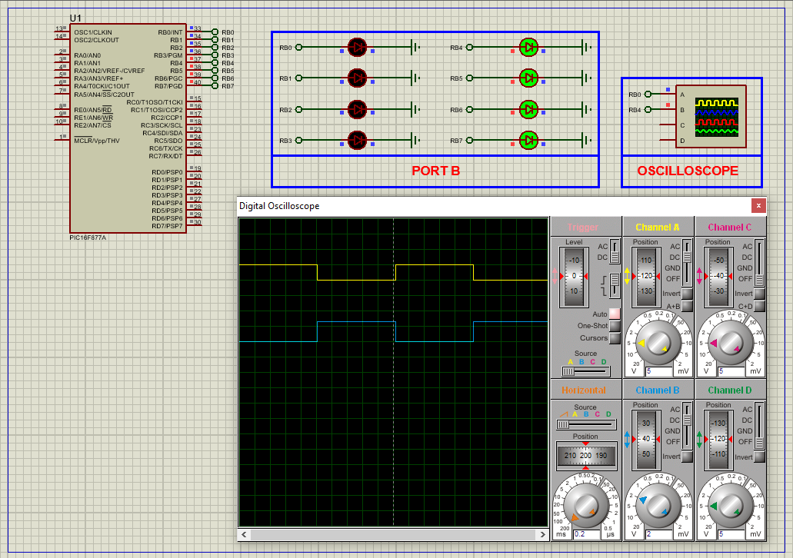

# PIC16F877A Watchdog Timer (WDT): System Stability and PORTB Control

This project demonstrates how to implement the **Watchdog Timer (WDT)** using the **PIC16F877A microcontroller** to enhance system reliability. The WDT is configured to automatically reset the MCU in case of software hangs, while the main application controls **PORTB** outputs and avoids unnecessary resets by periodically clearing the WDT during delay cycles.

---

## Hardware Requirements  
  
- **PIC16F877A Microcontroller**  
- **LEDs** (x2: RED and GREEN connected to PORTB)  
- **4MHz Crystal Oscillator** + **2x 22pF Capacitors**  
- **5V DC Power Supply**

---

## Circuit Overview  
- **Outputs**:  
  - PORTB<0:7> → LED indicators (toggle between patterns)  
- **WDT Configuration**:  
  - Enabled via configuration bits  
  - Uses internal RC oscillator  
  - Prescaler set to 1:32 for extended timeout  
- **Power Supply**:  
  - VDD = +5V, VSS = GND  
- **Oscillator**:  
  - XTAL 4MHz for MCU operation  

---

## Software Requirements  
- **MPLAB X IDE** (v5.50+)  
- **XC8 Compiler** (v2.36+)  
- **Proteus 8.15+** (for simulation)

---

## Configuration Steps  

### Watchdog Timer Setup  
- **WDTE**: Enabled in configuration bits  
- **Prescaler**: Assigned to WDT  
- **Prescaler Value**: 1:32 for moderate timeout window  
- **Delay Management**: Uses software delay loop that clears WDT with `CLRWDT()`  

---

## Code Behavior Overview  
#### Key Functionality (Described Only):

1. **Initialization**:  
   - WDT enabled  
   - Prescaler configured for 1:32  
   - PORTB configured as **output**

2. **WDT Delay Function**:  
   - A custom function `long_delay_with_wdt()` delays in 1ms steps  
   - Calls `CLRWDT()` during each loop to prevent timeout reset

3. **Main Loop Logic**:  
   - Alternates PORTB pattern between `0x0F` and `0xF0`  
   - Each pattern is held for 1 second  
   - WDT is cleared regularly to avoid reset during delay

---

## Proteus Simulation Setup  
1. **Create New Project**  
2. **Pick Devices**:  
   - PIC16F877A  
   - LED-RED, LED-GREEN (connected to PORTB)  
3. **Oscillator Configuration**:  
   - Add 4MHz crystal and 22pF capacitors to OSC1 & OSC2  
4. **Virtual Instruments Mode**:  
   - Optional: Add Oscilloscope to observe digital transitions  
5. **Terminal Mode**:  
   - DEFAULT, POWER, GROUND  
6. **Load .hex file** into PIC and start simulation

---

## Key Applications of WDT  
- **Automotive Systems**: Ensures safety-critical software doesn't hang  
- **Medical Devices**: Maintains operation integrity  
- **Industrial Automation**: Recovers from runtime failures  
- **Consumer Electronics**: Adds safety resets to critical controls  

---

## Troubleshooting Guide

| Symptom                  | Likely Cause                   | Solution                            |
|--------------------------|----------------------------------|-------------------------------------|
| MCU resets unexpectedly  | WDT not cleared in time         | Ensure `CLRWDT()` is called regularly |
| PORTB doesn’t toggle     | Incorrect TRISB configuration   | Set TRISB = 0x00                     |
| No delay effect          | Incorrect `_XTAL_FREQ` defined  | Confirm frequency matches hardware  |
| WDT has no effect        | WDTE disabled or PSA misconfigured | Recheck configuration and prescaler |

---

## License  
**MIT License** — Free to use with attribution
