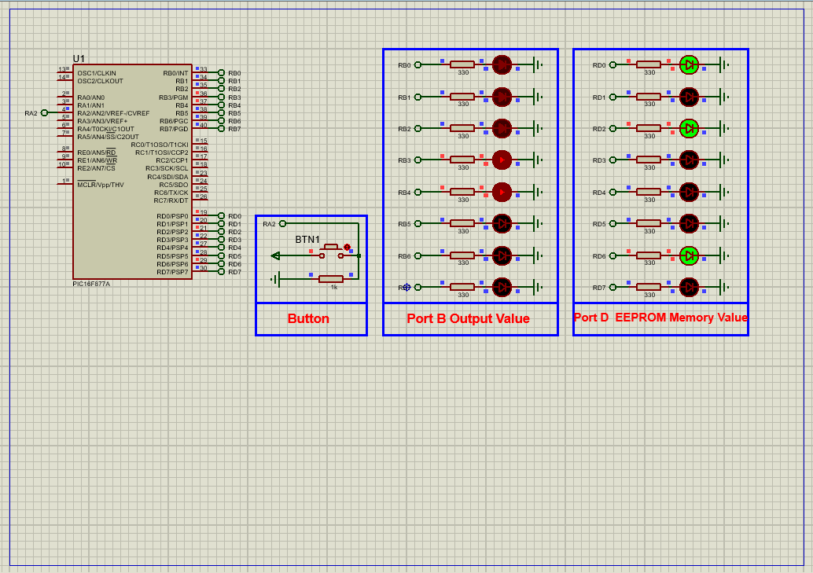

# PIC16F877A EEPROM Data Storage with LED Control

This project demonstrates the use of **internal EEPROM memory** in the **PIC16F877A microcontroller** to store and retrieve data persistently. Using a button, the user can save the value currently displayed on **red LEDs (PORTB)** into EEPROM and then read it back to show on **green LEDs (PORTD)**—even after a reset or power loss.

---

## Hardware Requirements  
  
- **PIC16F877A Microcontroller**  
- **Red LEDs** (x8 for displaying incremented values on PORTB)  
- **Green LEDs** (x8 for showing EEPROM-stored value on PORTD)  
- **Button** (connected to RA2 for triggering EEPROM write)  
- **330Ω Resistors** (for current limiting)  
- **4MHz Crystal Oscillator** + **2x 22pF Capacitors**  
- **5V DC Power Supply**

---

## Circuit Overview  
- **Inputs**:  
  - RA2 → Push button (used to write to EEPROM)  
- **Outputs**:  
  - PORTB → Red LEDs (incrementing visual counter)  
  - PORTD → Green LEDs (value read back from EEPROM)  
- **EEPROM Usage**:  
  - Stores value from PORTB at address 0x05 when button is pressed  
  - Retrieves the stored value and displays it on PORTD  
- **Oscillator**:  
  - 4MHz external crystal for timing stability  
- **Power Supply**:  
  - VDD = +5V, VSS = GND

---

## Software Requirements  
- **MPLAB X IDE** (v5.50+)  
- **XC8 Compiler** (v2.36+)  
- **Proteus 8.15+** (for simulation)

---

## Code Behavior Overview  
#### Key Features (Described Only):

1. **Initialization**:  
   - PORTB and PORTD configured as outputs  
   - PORTA configured as input (for button detection)  
   - All analog pins set to digital using `ADCON1 = 0x06`

2. **Main Loop Logic**:  
   - Continuously increments PORTB every 100ms  
   - If button on RA2 is pressed:  
     - Current value on PORTB is written to EEPROM at address `0x05`  
     - Same value is read back and shown on PORTD  
     - Button press is debounced to avoid multiple writes

3. **EEPROM Functions**:  
   - `EEPROM_Write()` performs a secure write sequence  
   - `EEPROM_Read()` retrieves stored data for display  

---

## Proteus Simulation Steps  
1. **Create New Project**  
2. **Pick Devices**:  
   - PIC16F877A  
   - LEDs (RED and GREEN), BUTTON, RESISTOR  
3. **Connections**:  
   - Connect 8 red LEDs to PORTB  
   - Connect 8 green LEDs to PORTD  
   - Connect a button to RA2 (with a pull-down resistor)  
   - Attach 4MHz XTAL and 22pF capacitors between OSC1 and OSC2  
4. **Terminal Mode**:  
   - Select DEFAULT, POWER, and GROUND  
5. **Run Simulation**:  
   - Load `.hex` file into PIC  
   - Watch PORTB increment  
   - Press button → value saved and echoed to PORTD

---

## Real-World Applications  
- **Settings Storage**: Save device preferences (volume, brightness, etc.)  
- **Data Logging**: Retain measurements after reboot  
- **Security Systems**: Store access attempts or password states  
- **Appliance Control**: Keep track of last mode or configuration  

---

## Troubleshooting Guide

| Symptom                  | Possible Cause                  | Suggested Fix                          |
|--------------------------|----------------------------------|----------------------------------------|
| PORTB not incrementing   | Delay or port misconfigured      | Verify `TRISB` and `__delay_ms()`      |
| PORTD not updating       | EEPROM read failed or not called| Confirm button press logic             |
| EEPROM write not working | Incorrect write sequence         | Ensure `INTCONbits.GIE` is managed     |
| Button not responding    | RA2 not set as input or bouncing| Use pull-down resistor + debounce delay|

---

## License  
**MIT License** — Free to use with attribution
